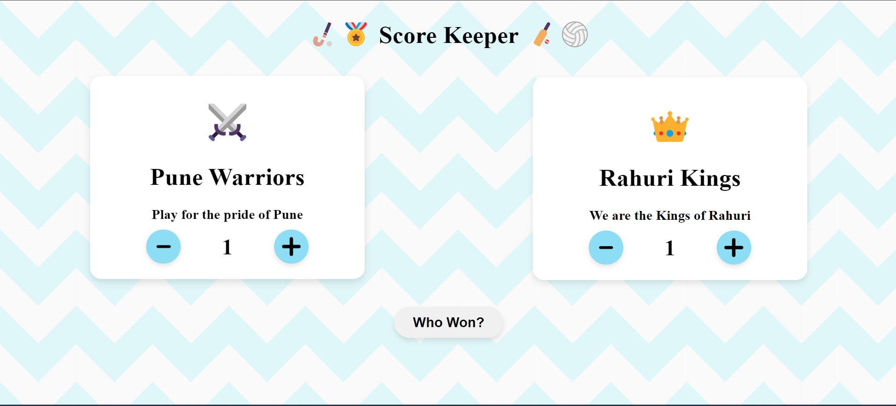

# Score Keeper

 A simple and efficient score-keeping application built with React.js. This app allows users to manage and track scores for multiple players or teams, making it ideal for games, tournaments, or any situation where score tracking is needed.

## Features
<ul>
<li>
<b>Multi-Player Support:</b> The app allows users to add multiple players
</li>
<li>
<b>Score Tracking:</b> Users can track scores for each player
</li>
<li>
<b>Score Reset:</b> Users can reset scores for each player
</li>
<li>
<b>Responsive Design:</b> Optimized for both desktop and mobile devices.
</ul>

## Demo 
[Live Demo](https://score-keeper-beige.vercel.app/)

## Contact
Feel free to reach out to me at sauravshete72@gmail.com if you have any questions or need further

